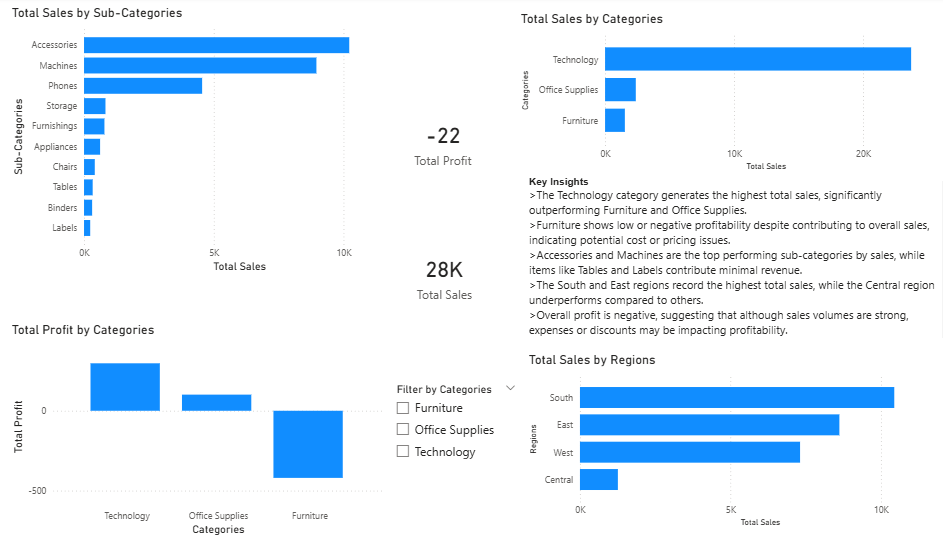

# Power BI Sales Dashboard

## 📊 Project Overview
This project analyzes sales data using Power BI to uncover insights related to revenue, profitability, and performance across categories, sub-categories, and regions.

## 🛠 Tools Used
- Power BI
- Sample Superstore Dataset

## 📈 Key Insights
- The Technology category generates the highest total sales, significantly outperforming Furniture and Office Supplies.
- Furniture shows low or negative profitability despite contributing to overall sales.
- Accessories and Machines are the top-performing sub-categories by sales.
- The South and East regions record the highest total sales, while the Central region underperforms.
- Overall profit is negative, suggesting pricing, discounting, or cost issues impacting profitability.

## 📷 Dashboard Preview

## 📁 Files Included
- `sales-dashboard.pbix` – Power BI dashboard file
- `dashboard-overview.png` – Dashboard screenshot
